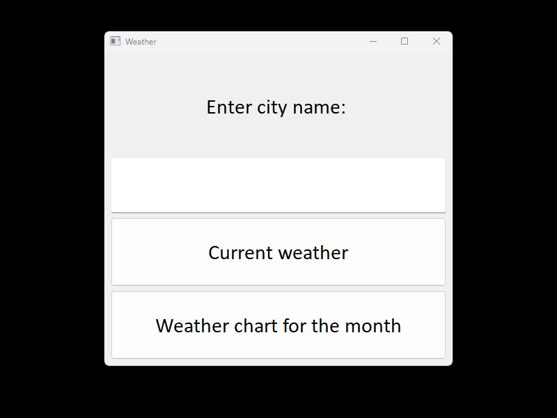

# 🌦️ Weather Analysis Suite

Комплексное решение для анализа погоды: Telegram-бот + GUI приложение с поддержкой ML-прогнозирования / Comprehensive weather analysis solution: Telegram bot + GUI application with upcoming ML forecasting support

## 📌 Features / Особенности

### Current Functionality / Текущий функционал
- **Telegram Bot**
  - Current weather (OpenWeatherMap API) / Текущая погода
  - 30-day historical data (Meteostat) / Исторические данные за 30 дней
  - Data visualization (Matplotlib) / Визуализация в виде графиков
  
 
 
 

- **GUI Application**
  - Current weather (OpenWeatherMap API) / Текущая погода
  - 30-day historical data (Meteostat) / Исторические данные
  
    

### Planned Improvements / Планируемые улучшения
- Weather forecasting using ML / ML-прогнозирование погоды
- Additional API integrations (GFS, ECMWF) / Интеграция новых API
- Personalized weather recommendations / Персональные рекомендации

## 🛠️ Tech Stack / Технологический стек

| Component       | Technologies                          |
|-----------------|---------------------------------------|
| Backend         | Python 3.13, Aiogram 3.x              |
| GUI            | PyQt5                                 |
| Visualization  | Matplotlib, Plotly                    |
| ML             | Scikit-learn, PyTorch (in development)|
| Data Sources   | Meteostat, OpenWeatherMap API         |

  
# Clone repository
git clone https://github.com/SpaceSurfer999/weather_app_and_tg_bot.git

cd weather_app_and_tg_bot

# Install dependencies
pip install -r requirements.txt

# Configure environment variables
cp .env.example .env

# 📝 Usage / Использование
### Telegram Bot:
python Bot/tg_bot.py

### GUI Application:

python App/weather_app.py

## 📜 License / Лицензия

This project is licensed under the MIT License - see the [LICENSE](LICENSE) file for details.

Этот проект распространяется под лицензией MIT - подробности см. в файле [LICENSE](LICENSE).
